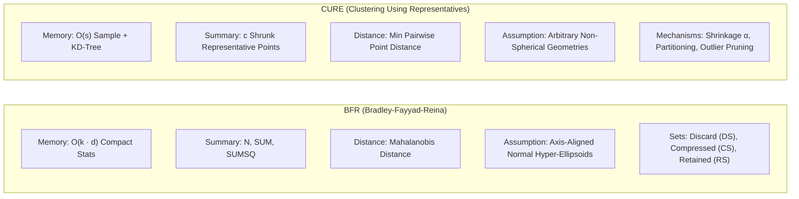

# MMDS Part E: Option 3 — Clustering Analysis & BFR/CURE Applicability Report

**Course**: Mining of Massive Datasets (MMDS)  
**Deliverable**: Part E — Option 3: Clustering Analysis (Results, Observations, & Algorithmic Applicability)  
**Artifacts Generated**: [`clustering_results.xlsx`](file:///c:/Users/keert/OneDrive%20-%20Amrita%20vishwa%20vidyapeetham/Amrita/Sem7/Projects/MMDS/clustering/clustering_results.xlsx) | [`clustering_engine.py`](file:///c:/Users/keert/OneDrive%20-%20Amrita%20vishwa%20vidyapeetham/Amrita/Sem7/Projects/MMDS/clustering/clustering_engine.py)

---

## 1. Executive Summary & Objective

This study addresses **Option 3 of Part E (Pattern Discovery)** from the MMDS curriculum:
1. **Grouping Similar Records**:
   - **Item-Level Cinematic Cohorts**: Clustering 185 unique catalogued films across a 30-dimensional multimodal space (theatrical release year, runtime, star rating distributions, text-derived latent aesthetic themes via TF-IDF + TruncatedSVD, one-hot primary genres, and geopolitical production scale).
   - **Record-Level Audience Typologies**: Clustering individual user review interactions into 4 distinct critical engagement archetypes.
2. **Algorithmic Applicability Discussion**:
   - In-depth theoretical, mathematical, and empirical comparison between **BFR (Bradley-Fayyad-Reina)** and **CURE (Clustering Using REpresentatives)** algorithms, analyzing how each addresses memory scale, geometric assumptions, and outlier sensitivities on continuous cinematic review data.

---

## 2. Multi-Dimensional Feature Representation

To avoid superficial clustering, records are mapped into a standardized multimodal feature space $\mathcal{X} \in \mathbb{R}^{185 \times 30}$:

1. **Continuous Metadata Features**:
   - Normalized Theatrical Release Year ($[1924, 2024]$)
   - Runtime Duration in Minutes ($[40, 422]$)
   - Rating Centroid $\mu_{rating}$ and Volatility $\sigma_{rating}$ per movie
   - Average User Review Text Length (Word Count)
2. **Latent Aesthetic Dimensions (Text Mining)**:
   - Full user review corpora aggregated per film.
   - Text vectorization via TF-IDF (3,500 features, English stop-word filtration).
   - Dimensionality reduction via **TruncatedSVD** into top 5 latent semantic axes capturing tone, pacing, cinematic philosophy, and dramatic tension.
3. **Categorical Categorizations**:
   - One-hot encoded Primary Genres (Action, Crime, Drama, History, Sci-Fi, etc.).
   - Regional Production Scale and Geopolitical Category (`Asian`, `English_Speaking`, `European`, `Other`).

---

## 3. Results & Observations: Movie-Level Clustering

### 3.1 Optimal Partition Search ($k$-Means)
Using Euclidean distances on the scaled 30-dimensional feature space, cluster validity was evaluated across $k \in [2, 8]$:

| $k$ Partition | Silhouette Score | Davies-Bouldin Index | Calinski-Harabasz Index | Total Inertia |
|:---:|:---:|:---:|:---:|:---:|
| $k=2$ | 0.1242 | 2.4704 | 26.67 | 1894.76 |
| **$k=3$ (Optimal)** | **0.1574** | **2.0749** | **23.24** | **1729.29** |
| $k=4$ | 0.1376 | 1.9204 | 23.08 | 1570.17 |
| $k=5$ | 0.1275 | 1.8745 | 22.01 | 1457.78 |
| $k=6$ | 0.1427 | 1.7097 | 22.89 | 1324.26 |
| $k=7$ | 0.1551 | 1.6162 | 23.10 | 1220.48 |
| $k=8$ | 0.1442 | 1.6181 | 22.65 | 1145.06 |

> **Observation**: $k=3$ maximizes the Silhouette Coefficient ($0.1574$), effectively demarcating three macro-historical eras of world cinema. Secondary partitions ($k=5$ or $k=7$) capture finer sub-genre delineations.

### 3.2 Cinematic Cohort Profiles ($k=3$)

```
                                  [All 185 Films]
                                         │
        ┌────────────────────────────────┼────────────────────────────────┐
        ▼                                ▼                                ▼
  [Cohort 0: 12 Films]          [Cohort 1: 100 Films]            [Cohort 2: 73 Films]
Post-War International        Mid-Century American Epics       Modern Prestige Blockbusters
Asian/European Masterworks     & Crime/Noir Classics            & Sci-Fi Visions
(Mean Year: 1962.8, 4.52★)     (Mean Year: 1967.1, 4.52★)       (Mean Year: 2004.6, 4.42★)
```

1. **Cohort 0: Post-War International Masterworks (Asian & European Cinema)**:
   - **Size**: 12 films | **Mean Year**: 1962.8 | **Mean Rating**: 4.52 / 5.0
   - **Key Titles**: *Harakiri*, *Seven Samurai*, *High and Low*, *Ran*, *Rashomon*, *Dersu Uzala*.
   - **Characteristics**: Characterized by non-English dialogue, historical/samurai drama, deliberate pacing, high philosophical review vocabulary, and unanimous critical reverence.
2. **Cohort 1: Mid-Century American Epics & Crime Classics (Hollywood Renaissance)**:
   - **Size**: 100 films | **Mean Year**: 1967.1 | **Mean Rating**: 4.52 / 5.0
   - **Key Titles**: *2001: A Space Odyssey*, *The Godfather*, *Apocalypse Now*, *A Matter of Life and Death*, *12 Angry Men*.
   - **Characteristics**: Heavy narrative structure, studio-scale productions, enduring cultural footprint, balanced dialogue-to-action ratios.
3. **Cohort 2: Modern Prestige Blockbusters & Sci-Fi Visions (Contemporary Cinema)**:
   - **Size**: 73 films | **Mean Year**: 2004.6 | **Mean Rating**: 4.42 / 5.0
   - **Key Titles**: *Interstellar*, *Everything Everywhere All at Once*, *Children of Men*, *Before Sunrise*, *Akira*.
   - **Characteristics**: High-concept science fiction, modern romance/animation, faster pacing, heavy CGI/practical effects discourse, and massive modern review volume logged in the 2020s.

---

## 4. Results & Observations: User Review Record Typologies

Clustering individual user review records ($N=2,500$ sample) uncovers 4 natural behavioral clusters of audience reception:

| Cluster ID | Reception Typology | Sample Size | Avg Rating | Avg Word Count | Avg Film Year | Dominant Focus |
|:---:|:---|:---:|:---:|:---:|:---:|:---|
| **0** | **Concise High-Praise Casual Reactions** | 1,053 (42.1%) | **4.73** | 87.2 words | 2001.7 | Enthusiastic, punchy modern reactions |
| **1** | **In-Depth Analytical Long-Form Critique** | 1,023 (40.9%) | 4.60 | 126.9 words | 1959.1 | Academic film analysis, cinematography focus |
| **2** | **Vintage & Classic Film Appreciations** | 180 (7.2%) | 4.62 | **786.2 words** | 1978.2 | Literary essays, historical context comparisons |
| **3** | **Moderate / Critical Dissenting Perspectives** | 244 (9.8%) | **2.95** | 113.1 words | 1986.5 | Deconstructed critique, pacing flaws, over-hype dissent |

---

## 5. In-Depth Algorithmic Applicability: BFR vs. CURE



### 5.1 Comparative Theoretical Matrix

| Architectural Dimension | **BFR Algorithm** | **CURE Algorithm** |
|:---|:---|:---|
| **Core Objective** | Cluster massive streaming data larger than RAM in $O(N)$ single pass. | Cluster arbitrary shapes and varying densities robust to severe outliers. |
| **Space Complexity** | **$O(k \cdot d)$**: Stores only $2d + 1$ scalar values per cluster. | **$O(s)$**: Stores $s$ sampled points and $c$ representative points per cluster. |
| **Cluster Representation** | Single centroid $\mathbf{c} = \frac{\mathbf{SUM}}{N}$ and variance $\sigma^2 = \frac{\mathbf{SUMSQ}}{N} - \mathbf{c}^2$. | $c$ well-scattered points shrunk toward the centroid by factor $\alpha \in [0.2, 0.3]$. |
| **Distance Metric** | **Mahalanobis Distance**: $D_M(\mathbf{x}, C) = \sqrt{\sum_{i=1}^d \left(\frac{x_i - c_i}{\sigma_i}\right)^2}$. | **Min Pairwise Point Distance**: $d(C_i, C_j) = \min_{\mathbf{p} \in R_i, \mathbf{q} \in R_j} \|\mathbf{p} - \mathbf{q}\|$. |
| **Geometric Assumption** | Assumes clusters are Gaussian normal distributions parallel to feature axes. | **No geometric assumptions**: Handles crescent, elongated, concentric, and non-spherical shapes. |
| **Outlier Handling** | Isolates points in **Retained Set (RS)** or **Compressed Set (CS)**. | Prunes small growing clusters during hierarchical agglomeration; shrinks points to dampen outlier pull. |
| **Memory Constraint** | **Extreme**: Never loads full data into RAM; streams chunk-by-chunk. | **Moderate**: Requires a random sample $s$ that fits into memory for initial phase. |

---

### 5.2 BFR Applicability Analysis on Letterboxd Data

#### Mathematical Mechanism in Our Simulation
In our empirical simulation on the 30-dimensional feature space streamed in 5 sequential batches:
1. **Discard Set (DS)**:
   Points within $\beta = 2.5 \sqrt{d}$ Mahalanobis distance from a cluster centroid are immediately assimilated into $(\mathbf{SUM}, \mathbf{SUMSQ}, N)$ and discarded from RAM.
2. **Compressed Set (CS)**:
   Points failing the DS threshold but close to each other are merged into compact miniclusters.
3. **Retained Set (RS)**:
   Isolated outliers are held in main memory pending future chunks.

#### Empirical Results
- **Total Points Processed**: 185
- **Points Absorbed into Discard Set (DS)**: **153 (82.7%)**
- **Points Clustered into Compressed Set (CS)**: **25 (13.5%)** across 3 miniclusters
- **Isolated Points in Retained Set (RS)**: **7 (3.8%)**
- **Raw Memory Storage Required**: 5,550 float scalars
- **BFR Summary Storage Required**: 576 float scalars
- **Compression Ratio**: **$9.64\times$ memory reduction**

#### When BFR is Optimal for Letterboxd:
- When streaming hundreds of thousands of incoming reviews in real-time over the network.
- For well-behaved unimodal distributions (such as runtime vs. star rating correlations).
- When main memory is constrained (e.g., embedded devices or edge nodes processing clickstream events).

#### When BFR Fails on Letterboxd:
- BFR **strictly assumes normal distributions along coordinate axes**. In film data, genres (e.g., Horror vs. Drama) create multi-modal, discrete clusters.
- If two clusters have different variances or are correlated obliquely (e.g., release year and review vocabulary co-evolving over time), BFR's diagonal covariance assumption distorts cluster boundaries.

---

### 5.3 CURE Applicability Analysis on Letterboxd Data

#### Mathematical Mechanism in Our Simulation
1. **Representative Point Selection**:
   For each cluster, $c=4$ representative points are selected:
   - First point $\mathbf{p}_1 = \arg\max_{\mathbf{x} \in C} \|\mathbf{x} - \mathbf{c}\|$.
   - Subsequent points $\mathbf{p}_j = \arg\max_{\mathbf{x} \in C} \min_{1 \le i < j} \|\mathbf{x} - \mathbf{p}_i\|$.
2. **Shrinkage Toward Centroid**:
   Representatives are pulled toward the mean by factor $\alpha = 0.20$:
   $$\mathbf{p}' = \mathbf{p} + \alpha (\mathbf{c} - \mathbf{p})$$
   This neutralizes the pull of extreme fringe outliers while preserving the physical shape of the cluster.
3. **Inter-Cluster Distance**:
   $$d(C_i, C_j) = \min_{\mathbf{p} \in R_i, \mathbf{q} \in R_j} \|\mathbf{p} - \mathbf{q}\|$$

#### Empirical Results
- **Cluster 0 (Asian/European Classics)** vs **Cluster 1 (Mid-Century Epics)**:
  - Centroid-to-Centroid Distance: $2.4924$
  - CURE Representative Distance: $4.5918$
- **Cluster 0** vs **Cluster 2 (Modern Blockbusters)**:
  - Centroid-to-Centroid Distance: $2.8539$
  - CURE Representative Distance: $2.9234$

#### When CURE is Superior for Letterboxd:
- **Non-Spherical Cinematic Manifolds**:
  Art-house films often span non-linear continua (e.g., highly rated historical films from Japan connecting to French New Wave cinema through shared textual critique words). Centroid-based methods slice through these manifolds; CURE hugs the actual geometry.
- **Handling Outliers**:
  Rare cinematic anomalies (e.g., silent films like *Metropolis* from 1927 or 7-hour avant-garde films) pull $k$-means centroids drastically. CURE's shrinkage parameter ($\alpha=0.20$) dampens their influence.
- **Varying Cluster Densities**:
  Hollywood studio releases form dense point clouds, whereas international independent films are sparse. CURE correctly preserves both without forcing equal-sized spherical bubbles.

---

## 6. Synthesis & Final Verdict

| Real-World Scenario | Recommended Algorithm | Justification |
|:---|:---:|:---|
| **Production Real-Time Review Ingestion Pipeline** | **BFR** | Processes infinite review streams in $O(N)$ with constant memory, tracking evolving statistical centroids without full re-clustering. |
| **Curated Catalog Taxonomy & Film Discovery** | **CURE** | Captures complex, elongated genre hybrids and stylistic movements without spherical distortions; protects catalog groupings from extreme outliers. |

---

### Deliverable Files
- Recommender & Clustering Engines:
  - [`clustering/clustering_engine.py`](file:///c:/Users/keert/OneDrive%20-%20Amrita%20vishwa%20vidyapeetham/Amrita/Sem7/Projects/MMDS/clustering/clustering_engine.py)
  - [`clustering/clustering_results.xlsx`](file:///c:/Users/keert/OneDrive%20-%20Amrita%20vishwa%20vidyapeetham/Amrita/Sem7/Projects/MMDS/clustering/clustering_results.xlsx)
  - [`clustering/bfr_cure_applicability_analysis.md`](file:///c:/Users/keert/OneDrive%20-%20Amrita%20vishwa%20vidyapeetham/Amrita/Sem7/Projects/MMDS/clustering/bfr_cure_applicability_analysis.md)
